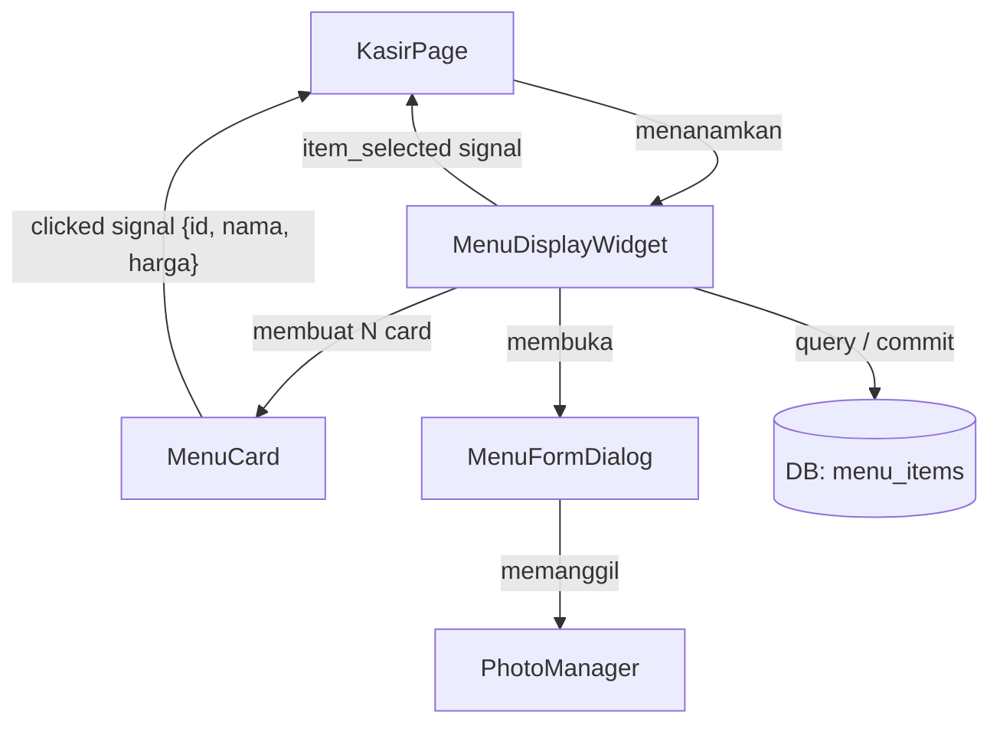
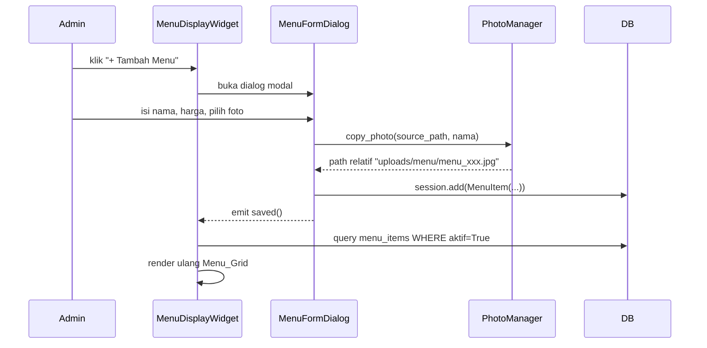

# Design Document: Menu Display Custom

## Overview

Fitur **Menu Display Custom** menambahkan etalase menu visual berbasis grid ke halaman kasir (POS) KasirKu. Admin dapat mengelola item menu secara mandiri — tambah, edit, hapus satu per satu, atau hapus semua sekaligus — lengkap dengan foto, nama, dan harga custom. Kasir hanya perlu melihat grid dan mengklik card untuk menambah item ke keranjang transaksi.

Fitur ini sepenuhnya terpisah dari manajemen barang/stok (`BarangPage`). Data menu disimpan di tabel `menu_items` tersendiri. Satu-satunya titik koneksi opsional ke `Barang` adalah field `barang_id` yang memungkinkan pengecekan stok saat item diklik.

Implementasi sepenuhnya di layer UI (PyQt5) dengan akses database langsung via SQLAlchemy, mengikuti arsitektur dan pola kode yang sudah ada di `BarangPage`, `KasirPage`, dan `BarangFormDialog`.

---

## Architecture

Fitur ini terdiri dari tiga lapis:

1. **Data Layer** — Model `MenuItem` baru di `database/models.py`, direktori upload `uploads/menu/` di `config.py`
2. **Service Layer** — `PhotoManager` sebagai helper statis untuk operasi file foto di `services/photo_manager.py`
3. **UI Layer** — Tiga komponen PyQt5 utama yang hidup di direktori `ui/menu/`:
   - `MenuDisplayWidget` — container utama dengan toolbar, search, dan grid
   - `MenuCard` — card visual satu item menu
   - `MenuFormDialog` — dialog tambah/edit item menu

Hubungan antar komponen:



Alur data saat admin menambah item:



---

## Components and Interfaces

### 1. `MenuItem` (database/models.py)

Model SQLAlchemy baru yang ditambahkan ke file `models.py` yang sudah ada, tepat setelah model `Barang`.

```python
class MenuItem(Base):
    __tablename__ = "menu_items"

    id         = Column(Integer, primary_key=True, autoincrement=True)
    nama       = Column(String(200), nullable=False)
    harga      = Column(Float, nullable=False)
    foto       = Column(String(255), nullable=True)   # path relatif dari BASE_DIR
    urutan     = Column(Integer, default=0)
    aktif      = Column(Boolean, default=True)
    created_at = Column(DateTime, default=datetime.now)

    def __repr__(self):
        return f"<MenuItem {self.id} - {self.nama} Rp{self.harga:,.0f}>"
```

Tabel dibuat otomatis oleh `Base.metadata.create_all(engine)` yang sudah dipanggil di `DatabaseManager.initialize()` — tidak perlu perubahan di `db.py` selain memastikan model di-import.

### 2. `PhotoManager` (services/photo_manager.py)

Helper statis untuk operasi foto, mengikuti pola upload di `BarangFormDialog`.

```python
class PhotoManager:
    UPLOAD_DIR: Path  # BASE_DIR / "uploads" / "menu"

    @staticmethod
    def ensure_upload_dir() -> None:
        """Buat direktori uploads/menu/ jika belum ada."""
        # mkdir(parents=True, exist_ok=True)

    @staticmethod
    def copy_photo(source_path: str, nama: str) -> str | None:
        """
        Salin foto dari source_path ke uploads/menu/ dengan nama unik.
        Format nama file: menu_{nama_slug}_{uuid6hex}{ext}
        nama_slug: lowercase, non-alphanumeric → '_', max 30 karakter.
        Kembalikan path relatif (str) jika berhasil, None jika gagal.
        """
```

Keputusan desain: `copy_photo` tidak melempar exception — error di-log ke console dan kembalikan `None` agar item tetap tersimpan meski tanpa foto.

### 3. `MenuFormDialog` (ui/menu/menu_form_dialog.py)

Dialog modal untuk tambah/edit `MenuItem`. Mengikuti pola `BarangFormDialog` secara penuh.

**Sinyal:**
- `saved = pyqtSignal()` — dipancarkan saat item berhasil disimpan

**Constructor:**
```python
def __init__(self, menu_item: MenuItem = None, parent=None)
# menu_item=None → mode tambah baru
# menu_item=<instance> → mode edit, form pre-populated
```

**Field form:**

| Field | Widget | Validasi |
|---|---|---|
| Foto | `QLabel` preview 68×68 + `QPushButton` pilih/hapus | Opsional; JPG/PNG/WEBP/BMP |
| Nama Menu | `QLineEdit` | Wajib; strip → tidak boleh kosong atau pure whitespace |
| Harga | `QDoubleSpinBox` (prefix `Rp `, max 999.999.999) | Wajib; harus > 0 |
| Urutan Tampilan | `QSpinBox` (0–9999) | Opsional; default 0 |

**Logika foto saat edit:**
- Ganti foto → copy foto baru, update `foto` field; foto lama **tidak dihapus** (mencegah kehilangan data)
- Hapus foto (tombol 🗑 Hapus Foto) → kosongkan field `foto` di DB; file fisik tidak dihapus

### 4. `MenuCard` (ui/menu/menu_card.py)

Card visual satu item menu. `QFrame` subclass mengikuti pola `ProductCard` di `kasir_page.py`.

**Sinyal:**
- `clicked = pyqtSignal(dict)` — payload: `{"id": int, "nama": str, "harga": float, "foto": str|None}`
- `edit_clicked = pyqtSignal(int)` — dipancarkan tombol edit (admin only), payload: `menu_item_id`
- `delete_clicked = pyqtSignal(int)` — dipancarkan tombol hapus (admin only), payload: `menu_item_id`

**Perilaku hover (admin):**
Tombol ✏ dan 🗑 tersembunyi secara default (`setVisible(False)`), ditampilkan saat `enterEvent` dan disembunyikan saat `leaveEvent`. Kasir tidak memiliki tombol overlay sama sekali.

**Elemen visual (atas ke bawah):**
1. `banner_lbl` (QLabel, tinggi 115px) — foto dengan rounded top corners radius 13px via `create_rounded_top_pixmap`, atau placeholder emoji/pastel menggunakan `get_product_icon_and_bg` jika foto tidak tersedia. Keduanya diimpor dari `kasir_page.py` (atau dipindahkan ke `utils/ui_helpers.py`).
2. `nama_lbl` (QLabel) — nama menu, rata tengah, bold
3. `harga_lbl` (QLabel) — harga format Rupiah via `format_rupiah`, rata tengah
4. (Kondisional) overlay label "Habis" berwarna merah jika `barang` terhubung memiliki `stok == 0`

### 5. `MenuDisplayWidget` (ui/menu/menu_display_widget.py)

Container utama. Ditanamkan ke `KasirPage` sebagai panel/tab alternatif etalase.

**Sinyal:**
- `item_selected = pyqtSignal(dict)` — diteruskan dari `MenuCard.clicked` ke keranjang `KasirPage`

**Antarmuka publik:**
```python
def refresh(self) -> None
    # Dipanggil saat halaman mendapat fokus navigasi (dari MainWindow._navigate)
def on_theme_changed(self, theme: str) -> None
    # Dipanggil dari MainWindow._toggle_theme
```

**Layout internal:**
```
┌─ Toolbar ──────────────────────────────────────────────────┐
│  [🔍 Cari menu...]   (spacer)   [+ Tambah]  [🗑 Hapus Semua]│
│                            (tombol admin only)              │
└─────────────────────────────────────────────────────────────┘
┌─ QScrollArea (WatermarkScrollArea) ────────────────────────┐
│  QWidget > QGridLayout (3 atau 4 kolom)                    │
│  [ MenuCard ]  [ MenuCard ]  [ MenuCard ]                  │
│  [ MenuCard ]  [ MenuCard ]  ...                           │
│               ATAU                                          │
│  QLabel "Tidak ada menu yang cocok" (jika filter kosong)   │
└─────────────────────────────────────────────────────────────┘
```

**Logika jumlah kolom:**
```python
def _get_column_count(self) -> int:
    return 4 if self.width() > 1100 else 3
```

Dipanggil ulang di `resizeEvent` untuk responsivitas.

**Integrasi ke `KasirPage`:**
`KasirPage` menambahkan `MenuDisplayWidget` di sisi kanan sebagai tab kedua atau panel atas scroll area etalase, kemudian meneruskan sinyal:
```python
self.menu_display = MenuDisplayWidget()
self.menu_display.item_selected.connect(self._add_to_cart_from_menu)
```

Method `_add_to_cart_from_menu(data: dict)` mengonversi payload menjadi `CartItem` dan menambahkannya ke keranjang.

---

## Data Models

### Tabel `menu_items`

| Kolom | Tipe SQL | Constraint |
|---|---|---|
| `id` | INTEGER | PRIMARY KEY, AUTOINCREMENT |
| `nama` | VARCHAR(200) | NOT NULL |
| `harga` | FLOAT | NOT NULL |
| `foto` | VARCHAR(255) | NULL (opsional) |
| `urutan` | INTEGER | DEFAULT 0 |
| `aktif` | BOOLEAN | DEFAULT TRUE |
| `created_at` | DATETIME | DEFAULT NOW |

### Struktur Direktori Foto

```
BASE_DIR/
  uploads/
    produk/          ← foto Barang (sudah ada)
    menu/            ← foto MenuItem (baru)
      menu_nasi_goreng_a1b2c3.jpg
      menu_ayam_bakar_d4e5f6.png
      ...
```

Format nama file: `menu_{nama_slug}_{uuid6hex}{ext}`
- `nama_slug` = nama lower, non-alphanumeric → `_`, max 30 karakter
- `uuid6hex` = 6 karakter hex dari `uuid.uuid4().hex[:6]`

### Config.py

Tambahkan konstanta baru di `config.py`:
```python
UPLOAD_MENU_DIR = UPLOAD_DIR / "menu"
UPLOAD_MENU_DIR.mkdir(parents=True, exist_ok=True)
```

### Dict payload sinyal `item_selected`

```python
{
    "id": int,           # MenuItem.id
    "nama": str,         # MenuItem.nama
    "harga": float,      # MenuItem.harga
    "foto": str | None,  # path relatif, untuk thumbnail di cart
}
```

---

## Correctness Properties

*A property is a characteristic or behavior that should hold true across all valid executions of a system — essentially, a formal statement about what the system should do. Properties serve as the bridge between human-readable specifications and machine-verifiable correctness guarantees.*

### Property 1: Penambahan MenuItem valid memperbesar dan mempertahankan data

*For any* pasangan (nama, harga) yang valid (nama non-whitespace, harga > 0), setelah `MenuItem` baru disimpan ke database maka:
- jumlah `menu_items WHERE aktif=True` harus bertambah tepat satu, DAN
- query item terakhir yang ditambahkan harus mengembalikan `nama` dan `harga` yang identik dengan nilai yang disimpan.

**Validates: Requirements 1.1, 3.6**

### Property 2: Input nama whitespace-only dan harga tidak valid selalu ditolak

*For any* string nama yang seluruh karakternya adalah whitespace (spasi, tab, newline, kombinasi apapun), atau untuk nilai harga ≤ 0, fungsi validasi `MenuFormDialog` HARUS mengembalikan status gagal dan tidak menambahkan record apapun ke tabel `menu_items`.

**Validates: Requirements 3.5**

### Property 3: Soft-delete menghilangkan item dari daftar aktif

*For any* `MenuItem` yang memiliki `aktif=True`, setelah operasi soft-delete (set `aktif=False`) dieksekusi, query `menu_items WHERE aktif=True` TIDAK BOLEH mengandung item tersebut. Item HARUS masih ada di database (record tidak terhapus, hanya `aktif=False`).

**Validates: Requirements 5.3, 5.4**

### Property 4: Hapus semua mengosongkan seluruh item aktif

*For any* kumpulan `MenuItem` aktif (0 atau lebih item), setelah operasi "Hapus Semua" dieksekusi maka `COUNT(menu_items WHERE aktif=True)` HARUS sama dengan nol, sedangkan total baris di tabel (`COUNT(*)`) HARUS tetap sama (tidak ada row yang dihapus secara fisik).

**Validates: Requirements 7.3**

### Property 5: Filter pencarian hanya mengembalikan item yang namanya cocok

*For any* string query pencarian (non-kosong) dan daftar `MenuItem` aktif, semua item yang dikembalikan oleh fungsi filter internal `MenuDisplayWidget` HARUS mengandung query sebagai substring case-insensitive pada field `nama`. Tidak ada item yang lolos filter jika namanya tidak mengandung query.

**Validates: Requirements 8.1**

### Property 6: Penyalinan foto menghasilkan file yang dapat dimuat

*For any* path file gambar sumber yang valid (berformat JPG, PNG, WEBP, atau BMP), setelah `PhotoManager.copy_photo()` dipanggil:
- file harus benar-benar ada di `uploads/menu/`,
- path relatif yang dikembalikan harus dapat digabungkan dengan `BASE_DIR` untuk membentuk path absolut yang valid, DAN
- `QPixmap(absolute_path).isNull()` HARUS bernilai `False`.

**Validates: Requirements 1.4, 3.6, 4.3**

### Property 7: Klik card memancarkan sinyal dengan data yang benar

*For any* `MenuItem` aktif, ketika card-nya diklik oleh kasir, sinyal `clicked` HARUS dipancarkan dengan payload yang memiliki `id`, `nama`, dan `harga` yang identik dengan data `MenuItem` sumber.

**Validates: Requirements 6.1**

### Property 8: Edit MenuItem mempertahankan perubahan ke database

*For any* `MenuItem` yang ada di database dan pasangan (nama_baru, harga_baru) yang valid, setelah operasi edit-dan-simpan selesai, query `menu_items WHERE id=<id>` HARUS mengembalikan record dengan `nama` dan `harga` yang identik dengan nilai baru yang disimpan.

**Validates: Requirements 4.5**

---

## Error Handling

| Kondisi Error | Komponen | Penanganan |
|---|---|---|
| Nama menu kosong / pure whitespace | `MenuFormDialog` | Tampilkan error inline di `error_lbl`, dialog tidak ditutup |
| Harga ≤ 0 | `MenuFormDialog` | Tampilkan error inline di `error_lbl`, dialog tidak ditutup |
| File foto tidak ditemukan saat render card | `MenuCard` | Fallback ke placeholder emoji/pastel; tidak crash |
| Gagal menyalin file foto (disk penuh, permission denied) | `PhotoManager` | Log ke console; kembalikan `None`; item tetap tersimpan tanpa foto |
| Session database gagal commit | `MenuDisplayWidget`, `MenuFormDialog` | Rollback otomatis oleh context manager `db.get_session()`; tampilkan `QMessageBox.critical` |
| Direktori `uploads/menu/` belum ada | `PhotoManager.ensure_upload_dir()` | Buat otomatis dengan `mkdir(parents=True, exist_ok=True)` |
| `barang_id` terhubung tapi Barang tidak ditemukan | `MenuCard` | Abaikan referensi Barang; tampilkan card normal tanpa indikator stok |
| Stok Barang terhubung = 0 saat klik | `MenuCard` / `MenuDisplayWidget` | Tampilkan `QMessageBox.information` "Stok habis"; item tidak ditambahkan ke keranjang |

---

## Testing Strategy

### Unit Tests (example-based)

Ditulis di `tests/test_menu_display.py` menggunakan `pytest` dengan SQLite in-memory (pola dari `tests/conftest.py`).

Kasus yang HARUS dicover:
- Tambah `MenuItem` valid (nama + harga) → tersimpan di DB, `aktif=True`
- Tambah `MenuItem` nama kosong → tidak tersimpan, error dikembalikan
- Tambah `MenuItem` nama whitespace → tidak tersimpan
- Tambah `MenuItem` harga = 0 → tidak tersimpan
- Tambah `MenuItem` harga negatif → tidak tersimpan
- Edit `MenuItem` → field di DB berubah sesuai nilai baru
- Soft-delete satu item → `aktif=False`, tidak muncul di query aktif
- Soft-delete semua → `COUNT(aktif=True) == 0`, `COUNT(*) > 0`
- Filter pencarian: query match substring → item muncul di hasil
- Filter pencarian: query no match → list kosong
- Filter pencarian: query kosong → semua item dikembalikan
- `PhotoManager.copy_photo` dengan path valid → file ada di disk, path relatif valid
- `PhotoManager.copy_photo` dengan path tidak ada → tidak throw, kembalikan `None`
- Klik `MenuCard` → sinyal `clicked` dipancarkan dengan payload yang benar
- `MenuDisplayWidget` dengan `auth.is_admin=False` → tombol "+ Tambah" dan "🗑 Hapus Semua" tidak ada

### Property-Based Tests

Ditulis menggunakan **Hypothesis** (tambahkan ke `requirements.txt`: `hypothesis>=6.0`), disatukan dalam `tests/test_menu_display_pbt.py`.

Minimum **100 iterasi** per property test (default Hypothesis).
Setiap test HARUS memiliki komentar tag: `# Feature: menu-display-custom, Property N: <teks>`

```python
from hypothesis import given, settings
from hypothesis import strategies as st

# Feature: menu-display-custom, Property 1: Penambahan MenuItem valid memperbesar dan mempertahankan data
@given(
    nama=st.text(min_size=1).filter(lambda s: s.strip() != ""),
    harga=st.floats(min_value=0.01, max_value=999_999_999, allow_nan=False, allow_infinity=False)
)
@settings(max_examples=100)
def test_add_menu_item_grows_list(db_session, nama, harga):
    ...

# Feature: menu-display-custom, Property 2: Input nama whitespace-only dan harga tidak valid selalu ditolak
@given(nama=st.text(alphabet=" \t\n\r").filter(lambda s: len(s) > 0))
@settings(max_examples=100)
def test_whitespace_nama_rejected(nama):
    ...

@given(harga=st.one_of(st.just(0.0), st.floats(max_value=-0.01, allow_nan=False, allow_infinity=False)))
@settings(max_examples=100)
def test_invalid_harga_rejected(harga):
    ...
```

| Property | File | Tag komentar |
|---|---|---|
| Property 1 | `test_menu_display_pbt.py` | `# Feature: menu-display-custom, Property 1` |
| Property 2 | `test_menu_display_pbt.py` | `# Feature: menu-display-custom, Property 2` |
| Property 3 | `test_menu_display_pbt.py` | `# Feature: menu-display-custom, Property 3` |
| Property 4 | `test_menu_display_pbt.py` | `# Feature: menu-display-custom, Property 4` |
| Property 5 | `test_menu_display_pbt.py` | `# Feature: menu-display-custom, Property 5` |
| Property 6 | `test_menu_display_pbt.py` | `# Feature: menu-display-custom, Property 6` |
| Property 7 | `test_menu_display_pbt.py` | `# Feature: menu-display-custom, Property 7` |
| Property 8 | `test_menu_display_pbt.py` | `# Feature: menu-display-custom, Property 8` |

### Integrasi UI (manual smoke test)

Pengujian otomatis widget PyQt5 membutuhkan display server dan sangat bergantung pada environment. Pengujian UI dilakukan manual dengan checklist berikut:

1. Jalankan aplikasi → navigasi ke Kasir → `MenuDisplayWidget` tampil
2. Login admin → tombol "+ Tambah" dan "🗑 Hapus Semua" terlihat
3. Login kasir → tombol-tombol admin tidak terlihat
4. Tambah item dengan foto → card muncul di grid dengan foto (rounded top)
5. Tambah item tanpa foto → card muncul dengan placeholder emoji/pastel
6. Hover card (admin) → tombol ✏ dan 🗑 overlay muncul
7. Edit item → form terbuka dengan semua field tersisi dengan data item
8. Hapus satu item → dialog konfirmasi muncul dengan nama item, item hilang setelah konfirmasi
9. Hapus semua → dialog menyebut jumlah item, grid kosong setelah konfirmasi
10. Klik card → item masuk keranjang kasir dengan nama dan harga yang benar
11. Ketik di search box → grid berfilter real-time (debounce 300ms)
12. Toggle tema → warna card, teks, dan border menyesuaikan tema aktif
13. Resize window melebihi 1100px → grid beralih ke 4 kolom
